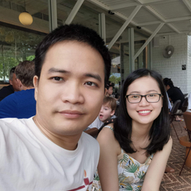

Hi! I'm Bong.

I'm from Ninh Binh, Vietnam but now I'm living in Sydney, Australia. Currently I work at [SafetyCulture](https://safetyculture.com/) as a senior software engineer. Formerly, I was a lead software engineer in Grab, a backend software engineer at TinTin (a fintech startup), and a game developer at Gameloft. Prior to that, I studied at Hanoi University of Engineering and Technology, Vietnam National University and earned a bachelor's degree in Computer Science.

Although my focus is on distributed systems in [Go](https://golang.org/) programing language, I'd like to spend some time with frontend technologies mostly for building my personal website. And in general, I like to write codes to solve problems that have impacts on people's lives.

For your visualisation, here is my wife & me:

